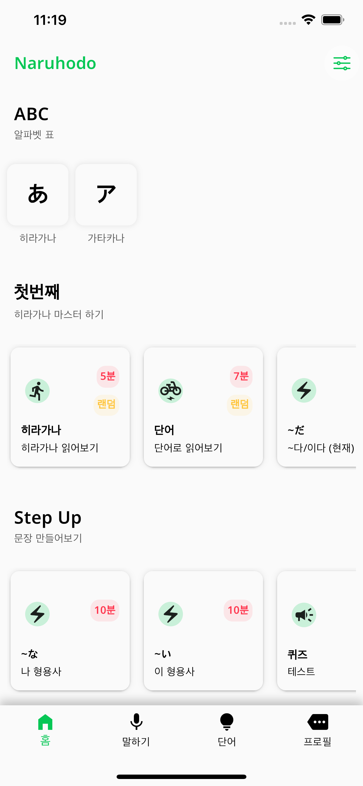
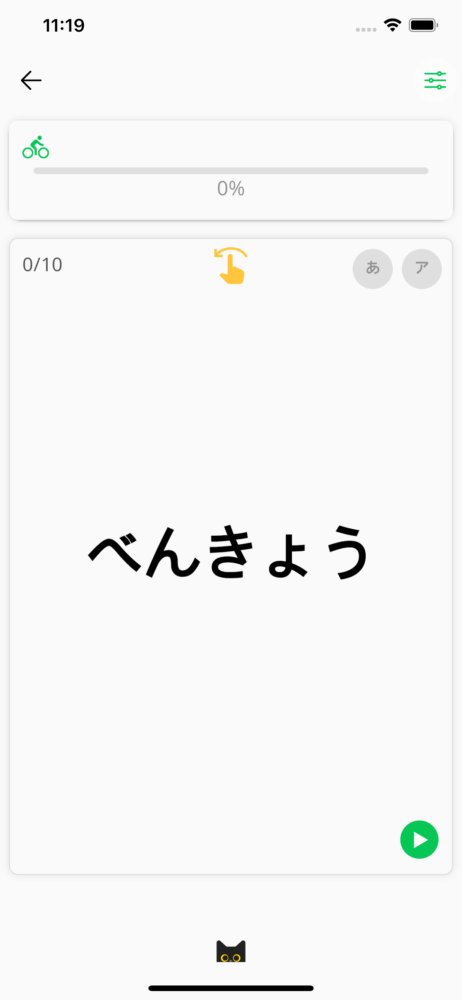

# Japanese Learning App

## Description

**Interactive Learning Tools**: Dive into learning with interactive flashcards that reinforce memory retention and enable quick revision of vocabulary and phrases. Our comprehensive learning is based on context learning, providing heaps of sentences with sound.

## Features

- **Interactive Flashcards**: Enhance your memory retention with interactive flashcards.
- **Context Based Learning**: Learn vocabulary and phrases within the context of full sentences, complete with audio.
- **Speaking Test**: Test your speaking skills to improve quickly.

## Technology Stack

- **Front-End**: Flutter, Dart
- **Back-End**: Firebase

## Links

- **GitHub Repository**: [Japanese Learning App](https://github.com/kanziman/naruhodo)
- **App Store**: [Download on the App Store](https://apps.apple.com/us/app/naruhodo/id6502181176)

## Screenshots

  
  
  
  
  
  
  
  
  
  

