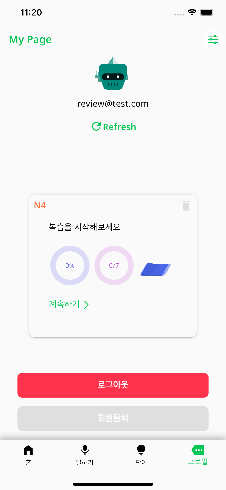

# Japanese Learning App

## Description

**Interactive Learning Tools**: Dive into learning with interactive flashcards that reinforce memory retention and enable quick revision of vocabulary and phrases. Our comprehensive learning is based on context learning, providing every sentences with sound.

## Features

- **Internationalization (Intl Package)**: Supports multiple languages using the `intl` package.
- **Theming**: Supports both dark and light modes.
- **Responsive UI**: Adapts to different screen sizes and orientations.
- **State Management**: Uses the `provider` package for state management.
- **Speech Recognition (speech_to_text)**: Integrates speech-to-text functionality using the `speech_to_text` package.

## Technology Stack

- **Front-End**: Flutter, Dart
- **Back-End**: Firebase

## Links

- **App Store**: [Download on the App Store](https://apps.apple.com/us/app/naruhodo/id6502181176)

## Screenshots

  
  
  
  
  
  
  
  
  
  
  

